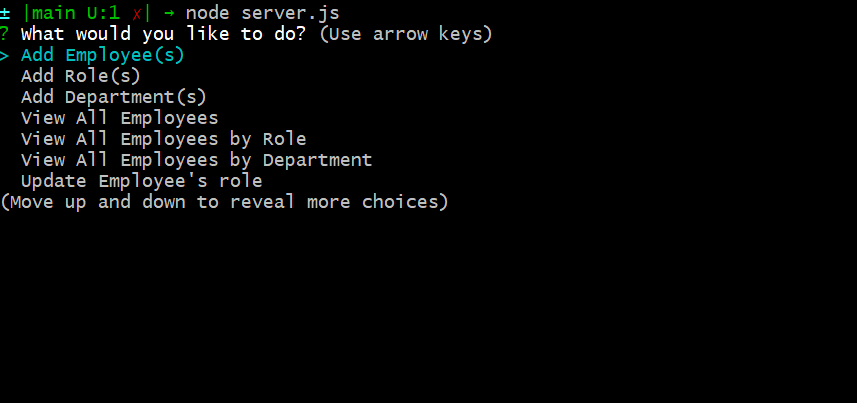

# Employee-tracker

Description
------------

Track your various employees by name, department, or role. You may add new departments, roles, and employees to your hearts content. You may also update your employee's role should they change position during their tenure.

 Table of contents
---------------
[Tools used](#Tools-used) 
[Demo link](#Demo-link) 
[Features](#Features) 
[Lessons learned](#Lessons-learned) 
[Credits](#Credits) 
[License](#License)

Tools used
-------------------

* console.table - Displays the data stored in MySQL database in a template layout table.
* GitBash - Assist with version control via commits, push, and pull to and from GitHub.
* GitHub - Site where the repository lies for deployment and edits.
* Inquirer - Allows prompting user for various information to fill out precreated team member sections.
* MySQL - Create databases to store our information and act on it.
* Node.js - Build the template and all functions in application. 
* VS Code - Application used to write and edit code for the application.

Demo link
-------------

Below is the link to the video demonstration the working application.  
[Link to video](https://drive.google.com/file/d/1iS4fXZFlSaduac4GZ1Ey6Xc56f54ogx4/view?usp=sharing)

Features
------------------

The user has the capablity to input employee name, role, and department information into this tracker. They may also create new department and roles as they desire. Upon adding new department and roles, when adding another employee, those roles and departments will appear as choices to apply to the employee along with existing roles and departments. The user may also update employee's role should that employee change roles.

Lessons learned
---------------------
Update employee is currenlt not functional and it will take a while to undo the logic behind what is breaking the code.

Credits
---------------
LinkedIn: [https://www.linkedin.com/in/vincent-nguyen-74226a107/](https://www.linkedin.com/in/vincent-nguyen-74226a107/)  
GitHub: [https://github.com/vincent-nguyen8931](https://github.com/vincent-nguyen8931)

License
----------
MIT License

Copyright (c) [2021] [Vincent Nguyen]

Permission is hereby granted, free of charge, to any person obtaining a copy
of this software and associated documentation files (the "Software"), to deal
in the Software without restriction, including without limitation the rights
to use, copy, modify, merge, publish, distribute, sublicense, and/or sell
copies of the Software, and to permit persons to whom the Software is
furnished to do so, subject to the following conditions:

The above copyright notice and this permission notice shall be included in all
copies or substantial portions of the Software.

THE SOFTWARE IS PROVIDED "AS IS", WITHOUT WARRANTY OF ANY KIND, EXPRESS OR
IMPLIED, INCLUDING BUT NOT LIMITED TO THE WARRANTIES OF MERCHANTABILITY,
FITNESS FOR A PARTICULAR PURPOSE AND NONINFRINGEMENT. IN NO EVENT SHALL THE
AUTHORS OR COPYRIGHT HOLDERS BE LIABLE FOR ANY CLAIM, DAMAGES OR OTHER
LIABILITY, WHETHER IN AN ACTION OF CONTRACT, TORT OR OTHERWISE, ARISING FROM,
OUT OF OR IN CONNECTION WITH THE SOFTWARE OR THE USE OR OTHER DEALINGS IN THE
SOFTWARE.